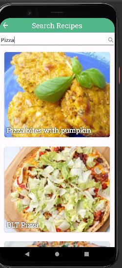
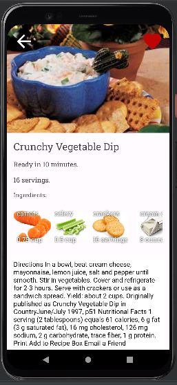

# Final project for the Android development module in HackerU fullstack JAVA and Android development course

## A fully functional Android app utilizing Spoonacular API to get information about thousands of recipes and RoomSQL to save your favorites.

## Summary
This project was built in Android Studio with Kotlin as the programming language for functionality and XML for the layout.
The project functions as an online cookbook and lets you search for recipes for many possible meals, view random recipes 
for ideas on what to cook next, and save your favorite recipes that you find on this app.

## Installation instruction.
To use, simply install the project and add to the project directory an apiKey.properties file containing an API key for Spoonacular in the following format:
SPOONACULAR_API_KEY = "example_api_key"
To get an API key simply sign up in https://spoonacular.com/food-api

## Following pictures explain app functionality in detail
* This is the home screen of the app. You can navigate from it to the different features of the app.

* Search recipes screen. Here you can search for recipes by keywords, such as "pizza" or whatever different type of food you're looking for a recipe of.

* Recipe details screen. Here you can view the details of a selected recipe, mark them as favorites, and find similar recipes at the bottom.

* Favorite recipes screen. Here you can see recipes you marked as favorites.

* Random recipes screen. Here you can find completely random recipes.

**Thanks for reading!**